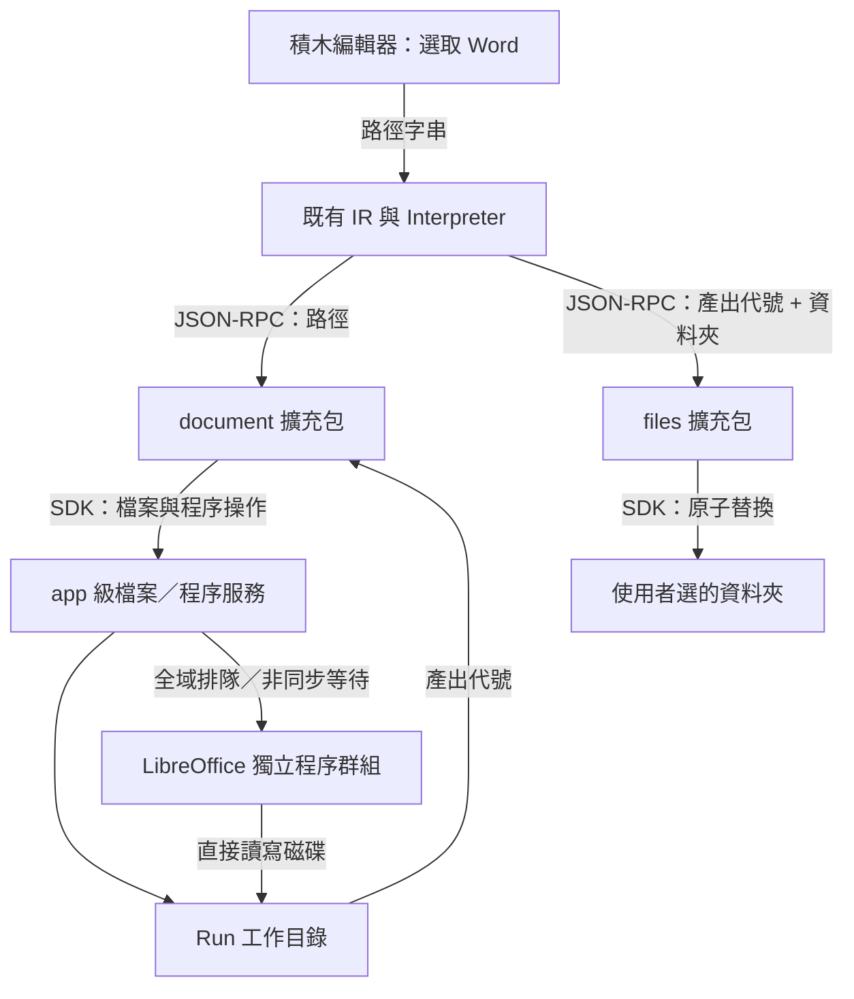

# 檔案處理架構與第一個積木包：Word → PDF

> 狀態：待實作設計，2026-09-06；2026-09-07 依現況覆核後修訂。本文描述要做的
> 工作，不代表目前已支援。
> 延伸 [`design.md`](design.md) §16 Q25；積木包安裝沿用
> [`extension-design.md`](extension-design.md)，專案匯出沿用
> [`project-storage-design.md`](project-storage-design.md)。

## 1. 目標與第一版範圍

讓使用者選擇本機 Word 文件、用一顆積木轉成 PDF，**再存回他自己選的資料夾**。
第一個 Blockyard 擴充包命名為 `document`，第一顆積木為 `document.word_to_pdf`，
以 LibreOffice 執行轉換；寫入磁碟由另一個包的 `files.save_to` 負責（§3）。

### 工作資料夾：IR 裡沒有絕對路徑

**這是第一版的一部分，不是加值功能。** 它是「路徑要怎麼寫進 IR」的答案，晚做
就是之後要遷移所有已經存在的專案。

積木裡的路徑一律寫成 `@輸入/報告.docx`。`@輸入` 是使用者指給**這個專案**的一個
具名工作資料夾：名字在 IR 裡，實際位置在這台機器上（§5）。於是：

1. **IR 裡永遠沒有絕對路徑。** 家目錄不進黃金軌跡、不進截圖、不進分享出去的
   專案。§3 的產出代號解決了輸出那一端，這一條解決輸入那一端。
2. **專案換得了機器。** 現在每個 path 欄位綁死一個絕對路徑，換台電腦要一顆一顆
   重選，而且沒有任何畫面說得出還剩哪幾顆沒改。具名之後是重指一次資料夾。
3. **匯入從「檢查」變成「授權」**（§5）——三者裡最重要的一條，也讓
   `api/files.py` 那條「路徑永遠不能來自 request body」的規則原封不動地活下來。

第一版以 **macOS、本機瀏覽器與後端在同一台電腦**為驗收環境，支援 `.docx` 與
`.doc`。Linux／Windows 的轉換邏輯可以共用，但程序樹終止與選檔需完成各平台驗收
後才宣稱支援。未支援的平台回明確錯誤，不退回無法確保取消的執行方式。

### 出口的決定：存回資料夾，不是瀏覽器下載

**後端就在使用者的電腦上，它讀得到來源檔案，就該寫得回去。** 讓產出只能從
執行紀錄下載，是把雲端的限制提前套在單機上：使用者要的是「轉完的 PDF 躺在
那個資料夾裡」，不是一個下載按鈕，而批次轉一百個檔案時那是一百個下載按鈕。

所以第一版的出口是 `files.save_to`。轉檔積木的產出先落在 Run 的暫存目錄，
**與 Run 同壽命**；要留下來就接一顆存檔積木。連帶地，原本設計裡的
artifact metadata 表、7 天保存期限、下載 API 與過期 UI 第一版都不做——它們存在
的唯一理由是「檔案沒有別的出口」，出口一開就不需要了（§10 說明它們何時回來）。

### 不在第一版

資料夾掃描與批次、Word 密碼輸入、PDF 選項、影片轉換、遠端上傳、雲端 worker
與 Tauri 不在第一版。

**資料夾批次不做的理由不是範圍取捨。** 迴圈那一半是現成的（`control.for_each`
已經有 `binds` + `scope: body` 的迴圈變數），缺的只是一顆「列出資料夾」。真正
的前提是：單檔跑通之前，「全域一格名額被一個迴圈包場」「一個壞檔案炸掉整個
迴圈」「一次 Run 產生兩百份產出怎麼呈現」這三件事都還沒有答案。§10 把它列為
後續第一順位，並寫明這三個前提。

## 2. 現況與架構決定

目前已有六種 JSON 相容值、非同步積木呼叫、每個擴充包的子行程、雙向 JSON-RPC、
Run 生命週期、取消通知與執行歷史。缺少的是 Run 的工作目錄、寫檔能力、積木選檔
介面，以及能跨 Run 管理重型程序的服務。

**檔案內容不經過 IR、積木變數、JSON-RPC 或 WebSocket。** 第一版檔案值就是
字串；新增 manifest 的 `path` 參數，僅表示選檔 UI 與字串參數驗證，
不新增第七種執行期值型別。不要把 PDF 或 Word 讀成完整 bytes／Base64 回傳。



轉換知識放在擴充包：支援格式、工具參數、輸出驗證與錯誤翻譯。
檔案與程序生命週期放在服務層：工作目錄、併發限制、取消、逾時與清理。
Interpreter 維持呼叫一顆非同步積木、等待結果的模型，不新增 job 積木或輪詢語法。

### 服務住在哪裡：**app 級，不是 Host 級**

這一條是照著現況修正的，不照著寫會壞掉：**registry 是每個 Run 一組的。**
[`runs/manager.py`](../backend/blockyard/runs/manager.py) 每次 Run 都
`open_project(...)` 開一整組 `SubprocessHost` 與 `CallContexts`，Run 結束
`unload_all()` 收掉。所以「跨所有 Run 共用的程序管理器」不能建在 Host 裡——
每個 Run 各一個 semaphore 正是必須避免的東西。

服務由 `create_app()` 建在 `app.state`，經 `RunManager` → `open_project` →
`open_registry` → Host 注入，是一個**可選**參數：

- `api/validation.py::open_project` 同時是**存檔驗證**的入口，
  `api/extensions.py` 的 dropdown／button 也會開一個沒有 Run 的 registry。
- 這兩條路徑不注入服務。積木在沒有 Run 上下文時碰 `ctx.files`，得到的是
  「這顆積木只能在執行中使用」，不是 `AttributeError`。

### 部署模式：非 loopback 就整組關掉

本機檔案能力（選檔對話框、讀來源、寫回資料夾）**只在 loopback 部署提供**。
執行期沒有 HTTP request 可以檢查——hat 與排程觸發的 Run 根本不是從瀏覽器來的——
所以這件事不是每次請求檢查，是一個**部署模式旗標**：

`cli.py` 已經知道 `--host` 綁在哪（它為此印過一次警告），由它算出 `local_only`
傳進 `create_app()`；非 loopback 時服務不建立，`document` 與 `files` 兩個包在
載入期就報「這個部署模式不提供本機檔案能力」。`api/files.py` 的 `require_local`
維持不變，管的是對話框那一側。

主設計 Q25 原先將選檔排到 Tauri 階段，但目前 `filedialog.open_file()` 已存在，
因此本機第一版可直接接上。這次不做後端任意目錄瀏覽 API。

## 3. 使用者看到的積木

```text
當點擊執行
  設定「PDF」為 [將 Word 檔案 @輸入/報告.docx 轉成 PDF]
  把「PDF」存到資料夾 (來源檔案旁邊)

執行紀錄
  已存到 @輸入/報告.pdf（~/Downloads/報告.pdf）
```

選檔發生在編輯積木時，不在每次 Run 途中彈出對話框；存檔保存路徑，之後重跑
讀取該位置當下的內容。檔案搬走或刪除時，要指向該顆積木說明「來源檔案不存在」。

### 為什麼寫入是獨立的一顆積木

不是在轉檔積木上加一格「輸出資料夾」。**寫入是這整套設計裡唯一不可逆的動作，
它應該只有一顆積木做得到**：匯入審閱要找的東西因此是一個名字，而不是一份
「哪些積木有輸出參數」的清單。往後的縮圖、合併 PDF、轉影片全部共用同一顆，
不必各自再實作一次檔名與覆寫規則——那種重複遲早有一顆漏掉。

### 兩個包的 manifest

`path` 是本次要新增的參數種類，`directory: true` 是它的修飾：

```yaml
manifestVersion: 1
id: document
name: 文件轉換
version: 0.1.0
author: blockyard
description: 將本機 Word 文件轉成 PDF，需要安裝 LibreOffice
color: "#3568A8"
requirements: []
palette:
  - opcode: word_to_pdf
    type: reporter
    returns: string
    text: "將 Word 檔案 %(source) 轉成 PDF"
    args:
      source: { type: path, default: "" }
```

```yaml
manifestVersion: 1
id: files
name: 檔案
version: 0.1.0
author: blockyard
description: 把積木產生的檔案存到你的資料夾
color: "#7A5C3E"
requirements: []
palette:
  - opcode: save_to
    type: command
    text: "把 %(file) 存到資料夾 %(folder)"
    args:
      file: { type: string, default: "" }
      folder: { type: path, directory: true, default: "@source" }
```

- `path` 接受路徑字串與回傳字串的積木，變數從輸入孔接進來。
  **插值預設關閉**：`${` 在檔名裡是合法字元，而變數不需要靠插值進來。
  值一律以 `@名稱` 開頭（見下）；絕對路徑與裸的相對路徑都拒絕。
- 欄位顯示 `@名稱/子路徑` 與「瀏覽…」，`directory: true` 開的是選資料夾的
  對話框。取消選檔保留原值；存在性由執行時檢查。
- 失敗沿用 `BlockError` 與既有錯誤捕捉機制，不回空字串或假成功物件。

### `./filename.pdf` 為什麼不收，以及 `@名稱` 是什麼

裸的相對路徑相對於後端的 cwd，而那是使用者當初在哪個目錄打 `blockyard serve`。
從 Finder 點開、從 launchd 起、之後包成 Tauri，每一種都不一樣，而畫面上沒有
任何東西說得出那是哪——同一份專案在兩台機器上寫到兩個位置，是最難查的一種 bug。

問題不在「相對」，在**沒有說出相對於誰**。所以路徑一律以 `@名稱` 開頭，
其餘一律拒絕。一條規則，兩種名稱：

```text
@輸入/報告.docx      使用者指給這個專案的具名工作資料夾（§5）
@輸入/2026/報告.docx 子路徑可以有多層
@source              來源檔案旁邊，產出專用，不由使用者指定
```

`@source` 就是使用者說 `./` 時真正的意思：那個位置明確、跟著來源走、換台機器
也還是對的，而且它**不指名任何新位置**——來源檔案的資料夾是使用者已經授權過的。

**「瀏覽…」仍然是主要互動。** 工作資料夾只決定 IR 裡存什麼：使用者選了
`~/Downloads/報告.docx`，編輯器發現它在 `@輸入` 底下，就存 `@輸入/報告.docx`。
打字（`@輸入/報…`）是額外的甜頭，不是取代對話框。

**不需要「一開始先設定」的前置步驟。** 選到的檔案不在任何工作資料夾底下時，
回一個可以點的錯誤：「把 `~/Downloads` 加為工作資料夾嗎？」——設定發生在它有
意義的那一刻，而不是一個沒有人會去的設定頁。這個形狀是照抄 D28 的金鑰
（`MissingSecretError` + `configure_secret`），連前端要做的事都一樣。

**多個工作資料夾從第一版就要有。** `~/Downloads` 進、`~/Documents/PDF` 出是
太常見的組合；逼使用者選一個同時包含兩者的祖先資料夾等於沒有限縮範圍。

### 產出值是代號，不是絕對路徑

`word_to_pdf` 回傳的是一個 app 內的不透明字串（`blockyard:artifact/<id>` 形狀），
不是 `/Users/…/報告.pdf`。它仍然是 string、仍然沒有第七種值型別、`files.save_to`
與往後的產檔積木照樣串得起來，但換掉了三個真實的問題：

1. **黃金軌跡會跟機器綁定。** `interpreter/events.py::normalize` 只正規化
   `runId` 與 `threadId`；一個絕對路徑會帶著家目錄與 runId 出現在 `block.exit`
   的值與 `印出` 的 log 裡，§17 的比對就不決定性了。
2. **執行歷史與專案匯出會帶出家目錄**，截圖與分享時一起走。`api/files.py`
   的 `_display()` 已經為了同一個理由把家目錄縮成 `~`。
3. **拿到純路徑分不出「Run 結束被清掉」「使用者自己刪了」「根本不是我們發的」**，
   說不出一句正確的錯誤。

輸入端同理：`stage_input()` 收 `@名稱/子路徑` 與產出代號兩種，不收絕對路徑。

## 4. 檔案服務與生命週期

資料根目錄使用 `blockyard_home()`，遵守既有 `BLOCKYARD_HOME` 設定：

```text
<blockyard_home>/runs/<ownerId>/<runId>/
  work/<callId>/        # 每次呼叫獨立：輸入快照、LibreOffice profile、產出
```

`ownerId` 在目錄裡：runs 表是 `(owner_id, id)` 複合主鍵，少了它多 owner 時撞名。
`runId` 在沒有 `runs_store` 的模式下是行程內遞增的 `r_1`，重啟會撞到上一輪留下的
目錄——所以**建立工作目錄一律 `mkdir` 不覆蓋，撞到就是內部錯誤**，不要默默沿用。

`callId` 必須每次呼叫唯一，同一顆積木在迴圈內重跑也不能共用目錄。
來源以分塊複製建立本次呼叫的輸入快照，不修改原檔，也不以 hard link 假裝快照。
複製前後檢查來源大小與修改時間，若偵測到變動則請使用者停止修改後重試；
不宣稱能對其他程序同時寫入的檔案提供原子快照。

分塊複製與 header 驗證走 `asyncio.to_thread`。這條在 subprocess 模式看不出來，
但 `InProcessHost` 之下積木包與後端在同一個事件迴圈上，阻塞的大檔 I/O 會卡住
整個後端。

保存規則，**一句話：產出與 Run 同壽命**：

- 呼叫完成、失敗或取消後刪除該次 work 目錄，必須先確定轉換程序已停止。
- Run 結束時刪掉整個 `runs/<ownerId>/<runId>/`。沒有 metadata 表、沒有 7 天、
  沒有過期狀態——**要留下來的東西已經在使用者的資料夾裡了**。
- 後端啟動時清掉所有殘留的 Run 目錄。未完成的 Run 由既有的
  `RunStore.reconcile_interrupted()` 標記，不自動續跑。
- 在變數或 persist 裡保存產出代號不會讓檔案活過 Run。過期代號再次使用時明確
  報錯——這是代號而非路徑換來的其中一件事（§3）。
- 專案 bundle 不包含輸入文件、轉換結果、工作資料夾的位置或 LibreOffice；移到
  其他機器要重指工作資料夾（§5）並安裝工具。匯出介面要說明這件事。

### 一條 resolve 規則管所有路徑

所有 `path` 值——輸入、輸出、`@source`——走同一條：查出 `@名稱` 在這台機器上的
實際位置，接上子路徑，resolve，**結果必須仍在那個工作資料夾底下**，否則錯。

- 子路徑可以有多層，但含 `..` 的**語法層就先擋**，不只靠 resolve 之後檢查：
  兩層都做，因為第一層說得出一句好訊息，第二層擋得住 symlink。
- resolve 要跟隨 symlink 之後再比對，指向資料夾外的連結一律拒絕。
- 工作資料夾自己被搬走或刪掉時，錯誤要指名是**哪一個工作資料夾**不見了，
  而不是報一個使用者從來沒打過的路徑找不到。

這條規則原本只寫給寫入，現在是共用的——輸入端一樣需要它，而兩份實作遲早
會有一份漏掉。

### 寫進使用者的資料夾：覆蓋，但要原子

**同名就覆蓋。** 不加序號、不問、也不做覆寫開關——`報告 (2).pdf` 堆滿一個資料夾
才是真的難用，而重跑同一個流程本來就該得到同一份結果。這是生產力工具的正確
語意，不是妥協。

但**寫入方式必須是原子替換**，理由不是安全，是覆蓋本身會弄壞的一種情況：直接
開檔往目標寫，等於在寫進去的那一刻先把舊的清空；轉到一半工具掛掉、使用者按
停止、磁碟滿了——舊的沒了，新的也沒有。做法是寫進**同一個資料夾**裡的暫存檔，
驗證通過後 `os.replace()` 蓋過去；同一個檔案系統上 rename 是原子的，讀到的
永遠是完整的舊版或完整的新版。成本是零。

逃逸由上面那條 resolve 規則擋掉，寫入再多一條：**目標是資料夾時報錯**，
不試圖覆蓋。檔名由 host 從產出決定（來源檔名換副檔名），積木給不出路徑，
所以「檔名含分隔號」這種輸入根本進不來。第一版不支援改名。

## 5. SDK、跨行程通道與 API

以下是待新增的最小能力；名稱可照此實作，不把 Host 的 Python 物件傳進子行程。

| 能力 | 責任 |
|---|---|
| `ctx.workdir` | 本次呼叫專屬 work 目錄的路徑字串，由服務配置 |
| `await ctx.files.stage_input(path_or_handle)` | 解析、檢查及分塊複製來源，回傳工作目錄內路徑 |
| `await ctx.process.run(argv, timeout_seconds=300)` | 服務管理排隊與程序群組，cwd 固定為本次 workdir，回傳 exit code 與有界診斷文字 |
| `await ctx.files.publish(path, mime=...)` | 驗證 workdir 內的普通檔案、登記為本次 Run 的產出，回傳產出代號 |
| `await ctx.files.save_to(handle, folder)` | 驗證資料夾授權與檔名規則、原子替換寫入，回傳寫入位置的顯示字串（`@輸出/報告.pdf`） |

這些非同步操作經 HostChannel／JSON-RPC request-response 實作，
InProcessHost 測試路徑使用同一份服務。

### 呼叫身分：`CallContext` 要補三個欄位

服務由 ctx token 取得 Run、project、owner 與 call 身分，不能相信擴充包自己傳入
的 Run ID。但目前 `CallContext` 只有 `token / ext_id / thread_id / block_id`——
**`runId`、`projectId`、`ownerId` 要補上**。`Interpreter.run_id` 已經存在，由
`extensions/registry.py::_make_handler` 從 `t.interp` 帶進 `contexts.open(...)`。
InProcess 與 Subprocess 兩條路徑的合約測試要一起更新。

### 工作資料夾住在哪：跟金鑰同一條線

[`extensions/secret_store.py`](../backend/blockyard/extensions/secret_store.py)
已經把這個形狀走完了——**一個值屬於一個專案、存在這台機器上、不進 bundle、
沒設定時給一個可以點的錯誤**。工作資料夾要的一模一樣，差別只在它不是機密，
所以放 SQLite 一張小表而不是 keyring：

```text
project_folders(owner_id, project_id, name, path, created_at)
PRIMARY KEY (owner_id, project_id, name)
```

- **範圍是專案，不是機器。** 理由同 §16 Q23：兩個專案各自處理不同來源的檔案是
  最普通不過的事，共用一份清單等於後設的蓋掉先設的，而畫面上沒有東西說得出來。
- **不進 bundle。** 匯出的專案只帶得走名字（`@輸入`），帶不走位置。
- 缺少時的錯誤沿用 D28 的形狀：`params` 帶專案與名稱，`action` 是一個新的
  `configure_folder`，前端據此開對話框並把名字填好。積木包不能自己造這個
  payload——跟 `require_secret` 一樣，它只從宣告來。

### 匯入從「檢查」變成「授權」

原本這裡寫的是「匯入審閱要把所有 `path` 值攤開給人看」。那要求使用者去讀別人
寫的絕對路徑並判斷安不安全，是個很爛的差事。有了工作資料夾之後，匯入畫面問的是：

```text
這個專案需要兩個工作資料夾
  @輸入   ← 指給它哪個資料夾？  [瀏覽…]
  @輸出   ← 指給它哪個資料夾？  [瀏覽…]（這個專案會寫入並覆蓋同名檔案）
```

使用者在**給**權限，不是在**審**字串。而且這份專案從此碰不到那兩個資料夾以外的
任何東西——這比 §2 的部署模式旗標細緻得多，是真正的範圍限縮。寫入用的資料夾
分開標示並講明會覆蓋：覆寫是預設之後，代價從「多一個檔案」變成「少一個檔案」。

### API

| 端點 | 行為 |
|---|---|
| `POST /api/files/open-dialog` | 沿用 `require_local` 與原生對話框，`mode` 為 `file`／`directory`；選檔回顯示字串，選資料夾回一張一次性 token（見下） |
| `GET /api/projects/{projectId}/folders` | 這個專案用到哪幾個名字、各自指到哪、哪些還沒指定 |
| `PUT /api/projects/{projectId}/folders/{name}` | 指定位置。**只收 open-dialog 發的一次性 token，不收路徑字串** |
| `DELETE /api/projects/{projectId}/folders/{name}` | 收回授權 |

`filedialog.py` 的 `_SCRIPT` 目前只有 `askopenfilename` 與 `asksaveasfilename`，
要加 `askdirectory` 的第三個 mode，以及 `.doc`／`.docx` 的 `filetypes`——不加的話
那個對話框會列出所有檔案。另外**取消與逾時目前都回 `None`**，UI 分不出來；
五分鐘後的「什麼都沒發生」很困惑，兩者要能分辨。

### `api/files.py` 那條規則活了下來

[`api/files.py`](../backend/blockyard/api/files.py) 開頭那條規則很硬：**後端讀寫
的位置只能來自它自己剛剛開的對話框，永遠不能來自 request body**，所以匯出走的
是一次性 token，路徑只以顯示字串經過瀏覽器。

`path` 參數一度套不上它：token 是一次性的，而一顆積木要重跑一年。工作資料夾把
這件事解開了，而且不必動那條規則一個字：

- **絕對路徑只從 token 進來**（`PUT …/folders/{name}`），跟匯出同一條路。
- **IR 只說得出名字與子路徑**，而子路徑被限制在一個使用者授權過的資料夾裡。
- 瀏覽器仍然看得到顯示字串（`~/Downloads/報告.docx`），但它**說出來的話後端
  一個字都不採信**。

所以 `SaveTargets` 那個一次性 token 表直接沿用，不需要第二套機制；
`api/files.py` 的 docstring 補一段「工作資料夾為什麼是這條規則的延伸而不是例外」。

剩下的代價只有一條：**非 loopback 部署整組關掉**（§2）。工作資料夾限縮的是
「碰得到哪些資料夾」，不是「誰在按按鈕」——遠端部署下對話框開在別人的螢幕上，
那是另一個問題。

程序服務屬於既有「安裝後執行受信任 Python 擴充」模型，不是沙箱。
不提供讓網頁直接送任意命令的 HTTP API，也不將這次設計宣稱為第三方程式的資源隔離。

## 6. 轉換程序、記憶體與取消

程序管理器由應用程式持有，跨所有 Run 共用（§2）。第一版重型任務全域併發數為
**1**；先取得名額才建立輸入快照與啟動工具。排隊只持有少量 metadata。

**排隊要有上限。** 名額只有一格，而 hat 與排程可以持續產生工作；沒有上限的話
佇列會無限成長，而且「300 秒逾時從取得名額後計算」代表一個 Run 可以無限期卡在
排隊而不觸發任何逾時。第一版：佇列深度上限與排隊逾時各一個明確的值，超過就回
「目前有其他轉換在進行」，不要讓它靜靜地堆。等待期間可取消；排隊等待時間另外
顯示。

### 名額釋放與終止都在 parent 側，掛在 `CallContext` 上

這一條照著現況修正：**不能把釋放寫在擴充包的 `finally` 裡**。Run 被停掉時
`unload_all()` 會收掉子行程，那段 `finally` 不會跑，名額就永久漏一格——全域只有
一格，等於整台機器再也轉不了檔。

現成的正確掛點有兩個，都在 parent：

- `extensions/registry.py` 的 `finally: contexts.close(token)`。`host.call` 拋
  任何例外、task 被 cancel、worker 死掉，它都會跑。**名額與程序群組登記在
  `CallContext` 上，`CallContexts.close()` 是唯一的回收點。**
- `CallContext.on_cancelled`（SubprocessHost 已經用它推取消旗標給子行程）。
  **`cancel_thread()` 是唯一的終止入口**，多掛一個回呼就是這次要的東西。

停止 Run、逾時或擴充 worker 意外結束時，服務負責：

1. 標記呼叫取消；排隊中的工作移除，且不能再啟動轉換程序。
2. 對該任務的程序群組送終止訊號；5 秒內未退出則強制終止整個群組並等待回收。
3. 清理未發布檔案與 profile，釋放名額；取消期間完成的輸出也不發布、不寫入。

不能只殺 Python 擴充 worker；LibreOffice 是另一個程序，必須由服務保有生命週期。

LibreOffice 由服務使用 argument array 啟動，不使用 shell 拼接命令。
stdout／stderr 持續讀取，分別僅保留最後 64 KiB，避免等待時 pipe 塞滿或日誌吃滿記憶體。

**重啟殘留第一版做最輕的版本。** 啟動時清掉所有 Run 目錄、把未完成的 Run 標成
interrupted（`reconcile_interrupted()` 已經有），就這樣。headless 的 soffice 轉完
自己會退，而「保存程序識別資訊、核對啟動身分以避免 PID 重用誤傷」是整份設計裡
最貴、最難測的一段，價值卻最低。真要殺殘留，用
`-env:UserInstallation` 指向我們家目錄當辨識條件，比 PID 便宜也安全得多——列在
§10，不在第一版。

第一版以併發、逾時、分塊 I/O 與磁碟檢查降低資源壓力，**不承諾硬性 RAM 上限**。
LibreOffice 仍需載入文件、圖片與排版；輸入大小不是記憶體峰值。
複製與轉換前檢查可用磁碟空間；實際 ENOSPC 仍須處理為失敗並清理，
不假設輸出大小可由輸入精準推算。OS 級 RAM／CPU 配額留給後續平台隔離方案。

## 7. Word → PDF 擴充包

來源放 `backend/blockyard/_bundled/document/` 與 `backend/blockyard/_bundled/files/`，
各自包含 manifest、main 與包測試，沿用 bundled 包的鋪設、安裝及更新流程。
開發時使用 `--extensions blockyard/_bundled`，避免誤以為改 repo 就會更新使用者
已安裝的副本。

LibreOffice 是系統工具，不能寫進 Python `requirements` 假裝已安裝。
第一版使用 macOS 標準安裝位置 `/Applications/LibreOffice.app/Contents/MacOS/soffice`，
找不到再查 PATH 的 `soffice`／`libreoffice`。執行前檢查可執行性與版本；
缺少工具時回「請安裝 LibreOffice 後重試」及官方下載連結，不自動下載或安裝。
驗收紀錄保存實際版本，尚未測試前不宣稱支援所有版本。

每次呼叫使用獨立 profile，避免與使用者已開啟的 LibreOffice 共用實例。
下列是參數形狀示意，實作必須傳 argv list；profile URI 由 `Path.as_uri()` 建立：

```text
soffice
  -env:UserInstallation=<本次 workdir 中 profile 的 file URI>
  --headless
  --norestore
  --convert-to pdf:writer_pdf_Export
  --outdir <本次 workdir 中的 output 目錄>
  <已複製進 workdir 的來源絕對路徑>
```

LibreOffice 官方文件提供 [headless、convert-to 與 UserInstallation 參數](https://help.libreoffice.org/latest/en-GB/text/shared/guide/start_parameters.html?DbPAR=WRITER&System=WIN)，
PDF 匯出選項見 [PDF CLI Parameters](https://help.libreoffice.org/latest/en-US/text/shared/guide/pdf_params.html)。
第一版採預設 PDF 匯出，不暴露進階選項。

轉換流程：

1. 檢查路徑是可讀的普通檔案，副檔名不分大小寫，僅接受 `.doc`／`.docx`。
2. 檢查 LibreOffice，取得共用名額，建立輸入快照與獨立 profile。
3. profile 設定禁止文件巨集與自動更新外部連結；headless 本身不是此設定的替代品。
   密碼保護／需要互動的文件第一版不支援，不彈出背景對話框等待使用者。
4. 呼叫工具；驗證 exit code、預期 PDF 是否存在且非空，並讀取少量 header 確認 `%PDF-`。
   exit code 為 0 但沒有有效 PDF 一樣視為失敗；header 驗證也不代表版面正確。
5. `publish` 產出、回傳代號；finally 收程序、清暫存並釋放名額。

錯誤訊息區分來源不存在／不可讀、不支援格式、缺少工具、轉換失敗、逾時與空間不足。
可辨識密碼錯誤時說明不支援；無法辨識時回一般轉換失敗與有界診斷，不猜測原因。
不保證所有 Word 排版與 Microsoft Word 匯出完全一致，中文字型、表格、頁首頁尾
與分頁必須納入真實文件驗收。若需求是精確重現 Word 排版，再評估其他轉換引擎。

## 8. 前端與事件

manifest schema、後端參數正規化、共享 schema、前端型別及 Blockly 欄位一起增加
`path` 與 `directory` 修飾；runtime 仍正規化成 string。四個落點：
`extensions/manifest.py` 的 `ArgType` → 重新產生
`packages/shared-schema/manifest.schema.json`（`python tools/export_schema.py`，
有 stale 檢查）→ `packages/editor/src/types/manifest.ts` →
`packages/editor/src/blockly/define.ts` 的欄位 switch。
`ArgSpec._check` 目前限制 `interpolate` 只給 string／code，`path` 要一併處理
（預設關閉，見 §3）。IR 保存／載入與 Blockly round-trip 要維持一致。舊專案不需
遷移；舊版 Host 無法載入含 path 的新包，安裝審閱要明確報錯。

path 欄位畫的是 `@輸入/報告.docx`，不是完整路徑。三種狀態要分得出來：

- **已指定**：`@輸入/報告.docx`，滑過去才顯示它現在指到哪。
- **名字有、資料夾還沒指**：欄位變成一顆可以點的提示，點下去就是
  `configure_folder` 的對話框（§5）。這是匯入別人的專案之後最常見的狀態。
- **選到的檔案不在任何工作資料夾底下**：問「把 `~/Downloads` 加為工作資料夾嗎」，
  不要默默存一個絕對路徑，也不要只說「不合法」。

**錯誤訊息兩個都要講**：`找不到 @輸入/報告.docx（~/Downloads/報告.docx）`。
只講前者使用者去 Finder 找不到，只講後者他不知道要去改哪一格。

使用既有 log 通道顯示「排隊中／轉換中／完成」，不要為 LibreOffice 捏造百分比。
第一版不新增 progress 事件協定。

寫入結果寫一則 log，而且**兩種情況是兩句話**：

```text
已存到 @輸出/報告.pdf（~/Documents/報告.pdf）
已覆蓋 @輸出/報告.pdf（~/Documents/報告.pdf）
```

不問，但要說。家目錄照 `api/files.py::_display()` 的規則縮成 `~`。
這是少數幾個真實路徑刻意出現的地方——它寫給人看，不是給積木用。
第一版不新增產出列表、下載按鈕與自訂文件預覽面板。

## 9. 施工順序與驗收

所有項目目前皆待完成；每一步完成後再勾選。

- [ ] **值的形狀先定**：`path` 參數型別（四個落點）、`@名稱/子路徑` 語法、
  產出代號的字串形式、`stage_input` 兩種輸入。這一步決定 IR 長什麼樣，
  晚做就要遷移既有專案，先做。
- [ ] **工作資料夾**：`project_folders` 表、`PUT …/folders/{name}` 走
  `SaveTargets` 的一次性 token、`configure_folder` 錯誤與前端對話框、
  共用的 resolve 規則（§4）。
- [ ] **呼叫身分**：`CallContext` 補 `runId`／`projectId`／`ownerId`，
  兩種 Host 的合約測試一起更新。
- [ ] **檔案基礎**：app 級服務與注入路徑、Run／call 工作目錄、`publish`、
  `save_to` 的授權與原子替換、Run 結束與啟動時的清理。
- [ ] **程序基礎**：全域名額與排隊上限、SDK 與雙向 RPC、取消／逾時／worker
  掛掉時的收尾（掛在 `CallContexts.close` 與 `cancel_thread`）。
- [ ] **兩個包**：`document` 的 LibreOffice 探測、獨立 profile、輸出驗證；
  `files.save_to`。
- [ ] **編輯與結果 UI**：path 欄位三種狀態、選資料夾、`@source` 的顯示、
  錯誤訊息兩個都講、log 兩句話。
- [ ] **部署模式與匯入授權**：`local_only` 旗標一路到載入期報錯；匯入畫面問
  「這個專案需要哪幾個工作資料夾」，寫入用的分開標示。
- [ ] **整合驗收與文件同步**：更新主設計 Q25／P4 的實際狀態、README 與 PROGRESS；
  說明安裝 LibreOffice、產出與 Run 同壽命、專案不包含來源文件。

測試以行為為主：

| 類別 | 驗收內容 |
|---|---|
| 值與編輯器 | path 保持字串；瀏覽檔案、瀏覽資料夾、取消、變數接入與存檔重開皆可用；三種欄位狀態都畫得出來；既有積木不受影響 |
| 工作資料夾 | 存好的專案裡沒有絕對路徑；`PUT …/folders` 不收路徑字串只收 token；換一台機器重指資料夾後整份專案可跑；收回授權後積木報的是可以點的錯誤 |
| 路徑 resolve | `..`、絕對路徑、裸的相對路徑、指向資料夾外的 symlink 全部拒絕，輸入與輸出兩端行為一致；工作資料夾被搬走時錯誤指名的是那個名字 |
| 決定性 | 轉檔與存檔的黃金軌跡不含家目錄與 runId；同一份專案在兩台機器上事件序列一致 |
| Host 合約 | InProcess／Subprocess 使用相同服務；沒有 Run 上下文時給的是可理解的拒絕；所有 RPC 都只傳小型 JSON |
| 排隊與取消 | 兩個 Run 同時轉換實際只啟動一個；佇列超過上限有明確錯誤；排隊取消不啟動；執行取消與逾時後無 LibreOffice 殘留 |
| 名額不漏 | worker 崩潰、Run 中途停止、task 被 cancel 之後，下一個任務仍取得得到名額 |
| 寫入 | 同名覆蓋成功；覆蓋期間中止不會同時失去新舊兩份；寫入資料夾外的檔名、`..`、指向外部的 symlink、目標是資料夾皆被拒絕 |
| 檔案隔離 | 同名來源、同一積木重複呼叫不互相覆蓋；錯誤或過期的產出代號無法取用任意檔案 |
| 生命週期 | Run 結束後工作目錄消失；後端重啟清掉殘留並標記 interrupted；已存到使用者資料夾的檔案不受影響 |
| 部署模式 | 綁在非 loopback 時兩個包載入期就報錯，且沒有任何路徑可以繞過 |
| 匯入 | 匯入的專案在指定工作資料夾之前一顆檔案積木都跑不動；指定之後碰不到那些資料夾以外的任何東西 |
| 真實轉換 | `.doc`／`.docx`、中文與空白檔名、圖片、表格、多頁、中文字型；LibreOffice 已開啟時仍能獨立完成 |
| 不支援輸入 | 缺工具、缺檔、損壞文件、密碼文件皆得到可理解的失敗，不無限等待 |
| 資源 | 用圖片較多的大文件觀察 Host、worker、LibreOffice 各自峰值 RAM、耗時與磁碟；確認 Host 不持有完整文件內容 |

單元／合約測試使用可控制的假程序模擬塞滿 stderr、忽略終止訊號與產生後代程序。
真實 LibreOffice 測試獨立標記：未安裝時可跳過一般測試，但發佈驗收必須實際執行。
PDF 不比較完整二進位黃金檔；以可開啟、頁數／關鍵文字及人工版面檢查驗收。

## 10. 後續擴充

**資料夾批次是第一順位**，而且它缺的不是檔案服務——`control.for_each` 與 list
都是現成的，缺的只有一顆 `files.list_folder`。要動它之前，這三件事要先有答案：

1. **名額。** 一個兩百檔的迴圈會佔著唯一那格名額十幾分鐘，期間所有專案、所有
   排程觸發的轉換全部排隊。至少要有「同一個 Run 連續轉檔可以續佔名額」這類
   規則，否則每個檔案重排一次隊，結果是所有人都慢。
2. **錯誤語意。** 一個加密的 `.docx` 會讓 `for_each` 停在第 37 個。`try_catch`
   攔得住（`BlockError` 原樣往上送），但使用者對「批次」的直覺是跳過壞的繼續。
   這個落差用文件與範例解決，**不要在轉檔積木上長出「失敗時繼續」的參數**——
   那是把批次語意偷偷塞進單檔積木。
3. **呈現。** 一次 Run 兩百份產出，執行紀錄要怎麼講。存到資料夾之後這件事
   輕很多（兩百行 log 而不是兩百個按鈕），但仍要決定要不要摺疊。

`list_folder` 本身的規矩：順序固定（`sorted()`，否則兩次跑出來的順序不同，黃金
軌跡與使用者的心智模型一起壞）、不遞迴、不列資料夾、跳過隱藏檔、副檔名篩選當
參數、數量有上限且超過明確報錯（那個 list 會整份進變數與事件流）。

它跟**打字補完**是同一個能力的兩個入口，要一起想，不要各做一個：

- `GET …/folders/{name}/entries?prefix=` 讓使用者打 `@輸入/報` 就跳出候選。
- `files.list_folder` 讓積木在執行期拿到同一份清單。

兩者都是「列出一個已授權工作資料夾底下有什麼」——**這是「不做任意目錄瀏覽 API」
的第一個例外，而它之所以可以接受，正是因為範圍被工作資料夾框住了**。少了 §1 的
工作資料夾，這兩個入口都得從頭論證一次。第一版兩個都不做：`@輸入/報告.docx`
是使用者用對話框選出來的，沒有補完也活得下去。

其餘沿用同一組檔案／程序服務：圖片縮放、PDF 合併、MP4 → MOV。影片工具可另加
可量測的進度與較長逾時，不把 LibreOffice 的限制寫死成所有轉換的限制。

**下載那條路不是被砍掉，是被延後。** 它在兩種情況回來：非 loopback 部署（那時
「存到資料夾」是存到別人的機器，必須整組關掉），以及真的有雲端 worker 的時候。
那時要補的是 artifact metadata 表、保存期限與過期 UI、`GET /api/runs/{runId}/artifacts`
與下載端點；下載走檔案回應與 attachment，依登記內容串流，不接受任意 path query。
一併注意保存期限會與 `RUN_LIMIT_PER_PROJECT`（200）的 `prune()` 及
`delete_project_history()` 打架——artifact 應該活到「所屬 Run 被清掉」或期限的
較早者，而且清理程式碼放在同一個地方，不要另開一條定時任務去對帳。

重啟殘留的完整版（用 `-env:UserInstallation` 辨識我們自己的 soffice）也在這一組。

只有需要遠端上傳、跨機器 worker 或檔案跨 Run 永久保存時，才另設計檔案引用物件、
儲存後端與權限模型。現階段不引入 Redis／Celery，也不改 Interpreter 的資料流。
